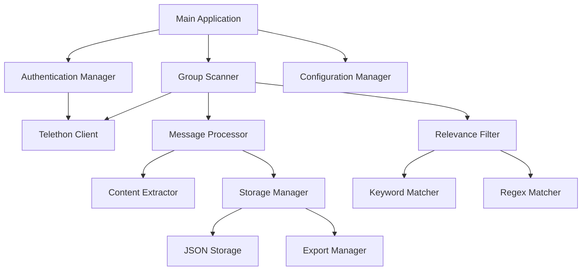

# Design Document: Telegram Group Scanner

## Overview

The Telegram Group Scanner is an asynchronous Python application that uses the Telethon library to authenticate as a user and monitor Telegram groups for relevant information. The system employs event-driven architecture for real-time message processing and includes robust error handling for API rate limits and network issues.

## Architecture

The application follows a modular, event-driven architecture with clear separation of concerns:



## Components and Interfaces

### 1. Authentication Manager
**Purpose**: Handles Telegram API authentication and session management

**Key Methods**:
- `authenticate()`: Manages initial authentication flow
- `load_session()`: Loads existing session if available
- `is_authenticated()`: Checks authentication status

**Dependencies**: Telethon TelegramClient

### 2. Group Scanner
**Purpose**: Discovers groups and manages message scanning operations

**Key Methods**:
- `discover_groups()`: Retrieves accessible groups/channels
- `start_monitoring()`: Begins real-time message monitoring
- `scan_history()`: Processes historical messages
- `handle_new_message()`: Processes incoming messages

**Event Handlers**:
- `@client.on(events.NewMessage)`: Real-time message processing

### 3. Message Processor
**Purpose**: Extracts and processes message content

**Key Methods**:
- `process_message()`: Main message processing pipeline
- `extract_text()`: Extracts text from messages and media
- `extract_metadata()`: Gets sender, timestamp, group info
- `handle_media()`: Processes images with OCR if needed

### 4. Relevance Filter
**Purpose**: Determines if content matches user-defined criteria

**Key Methods**:
- `is_relevant()`: Main relevance checking method
- `match_keywords()`: Keyword-based matching
- `match_regex()`: Regular expression matching
- `evaluate_criteria()`: Combines multiple criteria with AND/OR logic

**Configuration**:
- Keyword lists
- Regex patterns
- Logical operators (AND/OR)

### 5. Storage Manager
**Purpose**: Handles data persistence and export

**Key Methods**:
- `store_message()`: Saves relevant messages
- `check_duplicate()`: Prevents duplicate storage
- `export_data()`: Exports in various formats
- `get_statistics()`: Returns scanning statistics

**Storage Format**:
```json
{
  "message_id": "unique_id",
  "timestamp": "2024-01-07T10:30:00Z",
  "group_name": "Group Name",
  "sender": "username",
  "content": "message text",
  "media_type": "photo|video|document|null",
  "extracted_text": "OCR text if applicable",
  "relevance_score": 0.85,
  "matched_criteria": ["keyword1", "pattern2"]
}
```

### 6. Configuration Manager
**Purpose**: Manages application settings and user preferences

**Configuration Structure**:
```python
{
    "api_credentials": {
        "api_id": "your_api_id",
        "api_hash": "your_api_hash"
    },
    "scanning": {
        "scan_interval": 30,
        "max_history_days": 7,
        "selected_groups": ["group1", "group2"]
    },
    "relevance": {
        "keywords": ["important", "urgent"],
        "regex_patterns": ["\\d{4}-\\d{2}-\\d{2}"],
        "logic": "OR"
    },
    "rate_limiting": {
        "requests_per_minute": 20,
        "flood_wait_multiplier": 1.5
    }
}
```

## Data Models

### Message Model
```python
@dataclass
class TelegramMessage:
    id: int
    timestamp: datetime
    group_id: int
    group_name: str
    sender_id: int
    sender_username: str
    content: str
    media_type: Optional[str]
    extracted_text: Optional[str]
    relevance_score: float
    matched_criteria: List[str]
```

### Group Model
```python
@dataclass
class TelegramGroup:
    id: int
    title: str
    username: Optional[str]
    member_count: int
    is_private: bool
    access_hash: int
    last_scanned: Optional[datetime]
```

### Configuration Model
```python
@dataclass
class ScannerConfig:
    api_id: str
    api_hash: str
    scan_interval: int
    max_history_days: int
    selected_groups: List[str]
    keywords: List[str]
    regex_patterns: List[str]
    logic_operator: str
    rate_limit_rpm: int
```

## Error Handling

### Rate Limiting Strategy
- **FloodWaitError**: Implement exponential backoff with the wait time provided by Telegram
- **Request Throttling**: Limit requests to 20 per minute by default
- **Retry Logic**: Maximum 3 retries with increasing delays

### Network Resilience
- **Connection Loss**: Automatic reconnection with exponential backoff
- **Session Expiry**: Prompt for re-authentication when needed
- **API Errors**: Graceful handling with detailed logging

### Error Recovery Patterns
```python
async def with_retry(func, max_retries=3):
    for attempt in range(max_retries):
        try:
            return await func()
        except FloodWaitError as e:
            await asyncio.sleep(e.seconds * 1.5)
        except ConnectionError:
            await asyncio.sleep(2 ** attempt)
    raise MaxRetriesExceeded()
```

## Correctness Properties

*A property is a characteristic or behavior that should hold true across all valid executions of a system—essentially, a formal statement about what the system should do. Properties serve as the bridge between human-readable specifications and machine-verifiable correctness guarantees.*

### Property 1: Session persistence round-trip
*For any* valid API credentials, establishing a session and then loading it should result in an authenticated state equivalent to the original session.
**Validates: Requirements 1.4**

### Property 2: Authentication error descriptiveness
*For any* invalid credential combination, the authentication process should return error messages that contain specific information about what went wrong.
**Validates: Requirements 1.5**

### Property 3: Group discovery completeness
*For any* authenticated session, group discovery should return all accessible groups with complete metadata (name, member count, access permissions).
**Validates: Requirements 2.1, 2.2**

### Property 4: Access permission graceful handling
*For any* group with restricted access, the scanner should handle the restriction without crashing and continue processing other accessible groups.
**Validates: Requirements 2.3, 2.4**

### Property 5: Message extraction completeness
*For any* message in a monitored group, the processor should extract all available content (text, media descriptions, metadata) without data loss.
**Validates: Requirements 3.3, 5.1**

### Property 6: Real-time processing consistency
*For any* new message arriving in a monitored group, the processing time and extracted data should be consistent regardless of message order or timing.
**Validates: Requirements 3.2**

### Property 7: Relevance filtering accuracy
*For any* message and any set of configured criteria, the relevance filter should correctly classify the message as relevant or not based on the logical operations (AND/OR) applied to the criteria.
**Validates: Requirements 4.3, 4.4**

### Property 8: Configuration hot-reload consistency
*For any* configuration change made while the agent is running, the new settings should be applied to all future operations without affecting ongoing processes.
**Validates: Requirements 4.5, 7.3**

### Property 9: Data serialization round-trip
*For any* extracted message data, serializing to JSON and then deserializing should produce equivalent data structures.
**Validates: Requirements 5.2**

### Property 10: Duplicate detection accuracy
*For any* set of messages containing duplicates, the storage system should identify and prevent storage of redundant information while preserving unique content.
**Validates: Requirements 5.3**

### Property 11: Exponential backoff behavior
*For any* failure scenario (network, storage, rate limiting), the retry mechanism should implement exponential backoff with increasing delays between attempts.
**Validates: Requirements 5.4, 6.1, 6.2**

### Property 12: Error recovery continuation
*For any* invalid message or processing error, the system should log the error and continue processing subsequent messages without interruption.
**Validates: Requirements 6.3**

### Property 13: Command state consistency
*For any* sequence of valid commands (start, stop, pause), the agent's operational state should always reflect the most recent command and be queryable.
**Validates: Requirements 7.2, 7.4**

## Testing Strategy

The testing approach combines unit tests for specific functionality with property-based tests for universal correctness properties.

### Unit Testing
- **Authentication flow**: Test specific credential validation scenarios and session management
- **Message processing**: Test text extraction with known message formats
- **Configuration management**: Test settings loading with specific configuration files
- **Error scenarios**: Test specific rate limiting and network failure cases
- **Integration points**: Test component interactions and data flow

### Property-Based Testing
Property-based tests will validate universal properties using the Hypothesis library with a minimum of 100 iterations per test. Each test will be tagged with the format: **Feature: telegram-group-scanner, Property {number}: {property_text}**

**Dual Testing Approach**: Unit tests verify specific examples and edge cases, while property tests verify universal correctness across all inputs. Both are complementary and necessary for comprehensive coverage.

### Testing Framework
- **Unit Tests**: pytest for test execution and fixtures
- **Property Tests**: Hypothesis for property-based testing with 100+ iterations per property
- **Async Testing**: pytest-asyncio for testing async functionality
- **Mocking**: unittest.mock for external API interactions during testing
- **Test Configuration**: Each property test references its design document property number